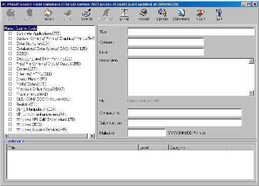

## Code of the Day Database \(updated\)

### Description

I started this application in order to gather somewhere all the code I receive every day from Planet Source Code (actually I gather the URL&#8217;s). There are a lot of improvements in this version, plus some bug fixes. Some of these are: importing PSC e-mails directly from the net, importing PSC e-mails from Outlook, better error handling and trace routines. Check out readme.htm for more details. The database now contains e-mails from Dec 14 1999 until Jun 19 2000. I have change (again) the database, so be careful.
 
### More Info
 

             |
---                |---
**Submitted On**   |2000-06-26 18:07:20
**By**             |[Yiannis Maheras](https://github.com/Planet-Source-Code/PSCIndex/blob/master/ByAuthor/yiannis-maheras.md)
**Level**          |Beginner
**User Rating**    |4.9 (79 globes from 16 users)
**Compatibility**  |VB 5\.0, VB 6\.0
**Category**       |[Databases/ Data Access/ DAO/ ADO](https://github.com/Planet-Source-Code/PSCIndex/blob/master/ByCategory/databases-data-access-dao-ado__1-6.md)
**World**          |[Visual Basic](https://github.com/Planet-Source-Code/PSCIndex/blob/master/ByWorld/visual-basic.md)
**Archive File**   |[CODE\_UPLOAD7396732000\.zip](https://github.com/Planet-Source-Code/yiannis-maheras-code-of-the-day-database-updated__1-8328/archive/master.zip)

